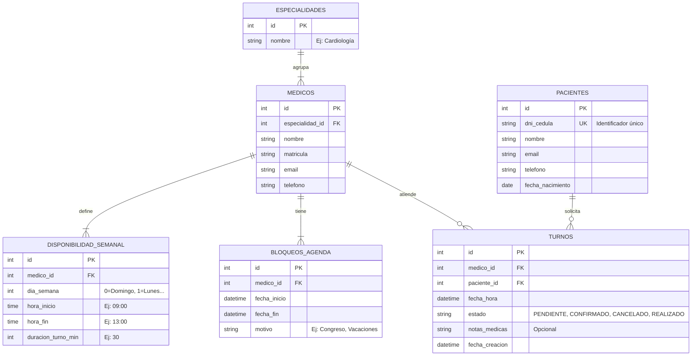

# Esquema de Base de Datos (ERD): Turnero Médico

Este diseño traduce nuestro modelo de dominio a tablas relacionales SQL.

## Diagrama Entidad-Relación

## Detalles de Implementación SQL

### Notas de Diseño
1.  **Tabla `DISPONIBILIDAD_SEMANAL`**: Es la clave de la eficiencia. En lugar de generar millones de filas de "huecos libres", guardamos solo las reglas.
    *   *Ejemplo*: Si el Dr. atiende Lunes de 9 a 17, es 1 sola fila en esta tabla.
    *   *Ahorro*: Para 1 año, nos ahorramos generar ~5000 registros vacíos por médico.

2.  **Tabla `TURNOS`**: Solo existe si hay una reserva real.
    *   **Índice Único**: `(medico_id, fecha_hora)` debe ser UNIQUE (excepto si el estado es CANCELADO) para evitar doble reserva a nivel de base de datos.

3.  **Auditoría**: `fecha_creacion` en Turnos nos sirve para saber cuándo reservó el paciente (útil para la regla de cancelación de "2 horas antes").
