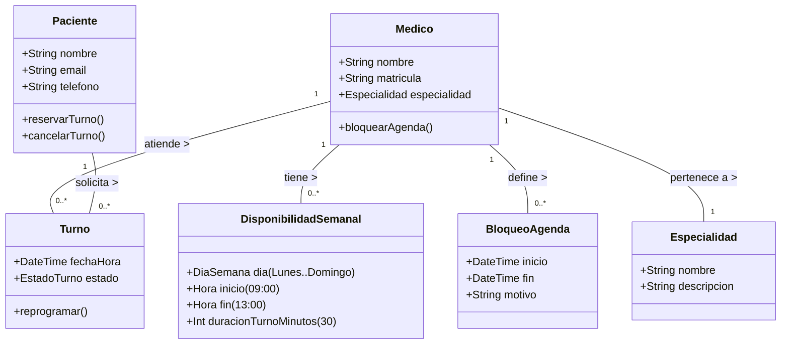

# Modelo de Dominio: Turnero Médico

Este modelo representa las entidades principales del negocio y cómo se relacionan entre sí.

## Diagrama de Clases (Conceptual)

## Diccionario de Datos

### 1. Entidades Core
- **Medico**: El profesional. Tiene una configuración de horarios base.
- **Paciente**: El usuario final.
- **Turno**: La reserva concreta.
    - *Estados Posibles*: `Pendiente`, `Confirmado`, `Cancelado`, `Realizado`, `Ausente`.

### 2. Entidades de Agenda (La parte compleja)
Para que el sistema sepa qué turnos ofrecer, no guardamos "todos los turnos libres del año" en la base de datos (sería ineficiente). En su lugar, usamos reglas:

- **DisponibilidadSemanal**: Define el patrón recurrente.
    - *Ejemplo*: El Dr. X trabaja los Lunes de 9 a 13.
- **BloqueoAgenda**: Excepciones a la regla.
    - *Ejemplo*: El Dr. X tiene vacaciones del 1 al 15 de Enero.

### 3. Algoritmo de Generación de Turnos (Lógica)
Cuando un paciente busca turnos para el "Lunes 10 de Octubre", el sistema:
1.  Verifica si es un Lunes.
2.  Busca la `DisponibilidadSemanal` del médico para Lunes.
3.  Genera slots en memoria (9:00, 9:30, 10:00...).
4.  Quita los que coincidan con un `Turno` ya reservado.
5.  Quita los que caigan dentro de un `BloqueoAgenda`.
6.  **Resultado**: Lista limpia de horarios disponibles.
