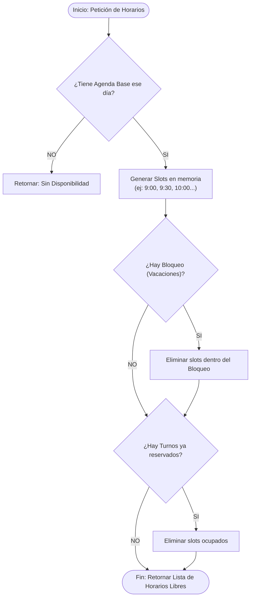
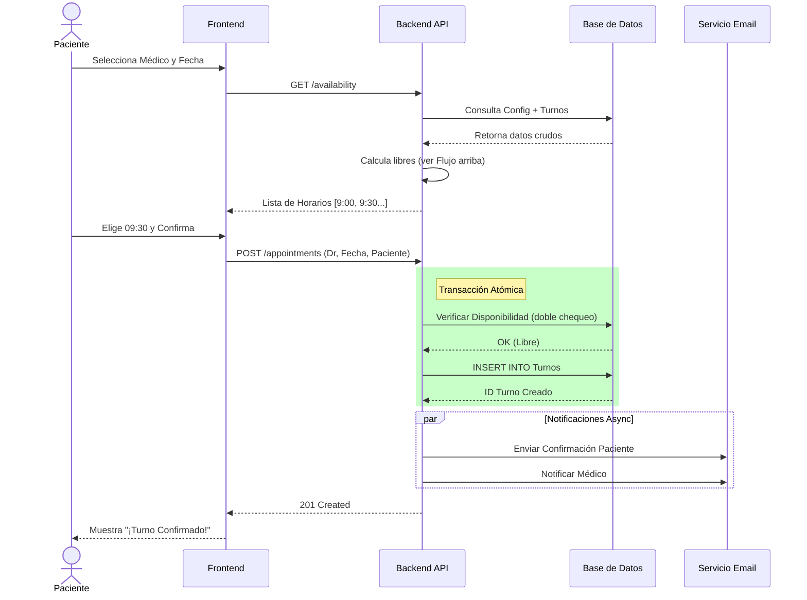
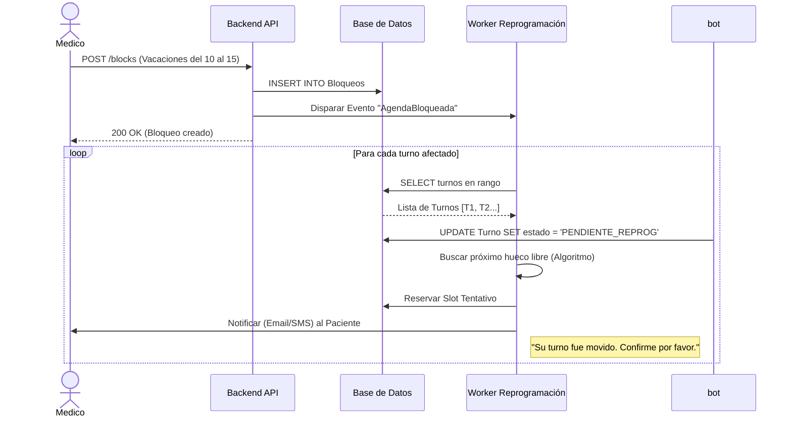

# Diagramas del Sistema: Turnero Médico

## 1. Diagrama de Flujo: Cálculo de Disponibilidad
Este diagrama explica la lógica que usa el sistema para responder a la pregunta: *"¿Qué horarios tiene libres el Dr. X el día Y?"*

## 2. Diagrama de Secuencia: Reserva de Turno (Happy Path)
Interacción cuando un Paciente reserva con éxito.

## 3. Diagrama de Secuencia: Cancelación Masiva (Caso Complejo)
Qué pasa cuando el Médico bloquea su agenda (RF-04).

